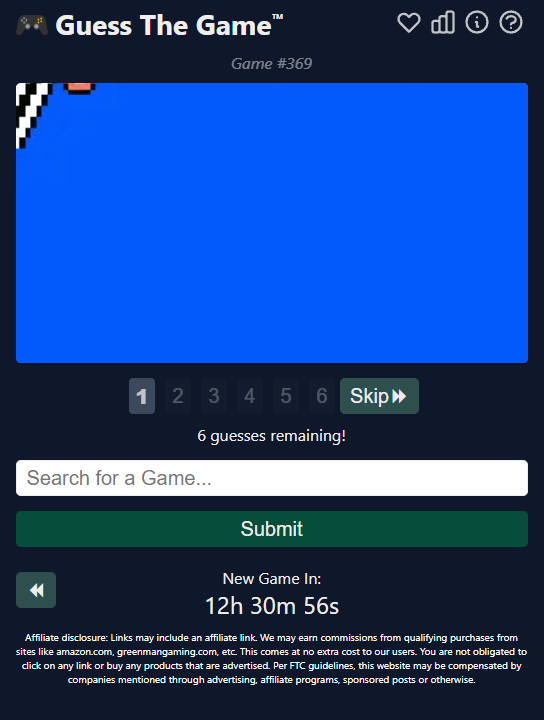

# Nani?! なに
Who's that Pokemon? The badly cropped Pokemon guessing game!
A game site where you guess the Pokemon of the day based on screenshots and hints.

## Aims

* Provide weirdly corpped screenshots of a daily Pokemon
* The user guesses using a predictive textbox

## Inspiration


## Extensions 
* "Not affiliated by Nintendo or Gamefreak" disclamer
* Arrow keys and enter to select on autocomplete. (<- Maybe later? It's a bit more complex than I thought it would be.)
* Style the pages so it looks good
* Show Google ads
* Hints for the Pokemon (Pokemon type, which generation it's in etc)
* History of guesses for player
* Store puzzles in a database
* Hosting images properly for free (using the Backblaze B2 and Cloudflare method https://jross.me/free-personal-image-hosting-with-backblaze-b2-and-cloudflare-workers/)
* Automate metadata collection for Pokemon

___________________________________________________________________________________________
## Running in you local env

- Go to the `my-app` folder
- Run `npm start`

(The rest of the instructions should be in the file `README.md` inside the `src` folder)

## URL structure
There are 2 pages
- `.../puzzle=...`
     - This is the homepage/ page where you guess the puzzle
     - The puzzle selected on the page is decided by the URL query
          - `.../puzzle=1` <- the value of puzzle is the puzzle number, puzzle 1 is the 0th index in the puzzle array
     - If the query is invalid, it will show the 1st puzzle
- `.../previous`
     - This is the page where you see a list of all the previous released puzzles and a link to play them
     - One new puzzle will be added automatically everyday to this list

## Code

### Guessing page `.../puzzle=...`

#### States
There are 5 states at the moment:
- `imageIndex`
     - This is the index of the image the user is currently viewing
     - `6` is the answer image (Uncropped image of the Pokemon)
- `guessIndex`
    - This is the guess the user is currently on
    - It starts on 0 and incriments for each guess the user has made
- `correctGuessIndex`
    - This shows which guess the user guessed correctly (or if they even guessed correctly at all)
    - `-1` means they have yet to guess correctly
    - `0` means they guessed correctly on their 1st guess
    - `1` means  they guessed correctly on their 2nd guess etc...

- `autoCompleteItems`
     - This is the list of Pokemon that are showing in the autocomplete
     - (See more about autocomplete below)
- `inputFieldValue`
     - This is what is currently showing in the input field

#### Autocomplete
- At the moment the autocomplete is picked from an array in `pokemonList.js`
     - (...because I'm bad at coding (Felix) and haven't gotten my head around fetching and async fucntions...)
     - We should add API Calls to fetch the data once I'm a bit more experienced
     - Will need to manually update the data once a new generation releases
- Autocomplete works currently by choosing all Pokemon which names begin in the string the user has typed

#### When does the Input Field show and other stuff
There are 3 options for that section, depending on what the state is.

- When the user has guessed the Pokemon correctly
     - A congratulations message will show, confirming the name of the Pokemon
- When the user is still guessing
     - The input field will show, allowing the user to make more guesses
- When the user has run out of guesses
     - A better luck next time message will show, while saying the name of the Pokemon

### Previous Puzzle page  `.../previous`

#### Uploading a new Puzzles
There is a file called `data.js`, in there is where the puzzles are uploaded.
- Each item of `puzzle` is a daily puzzle.
- To upload a puzzle there is an array of objects called `puzzle`, 
     - Pick a Pokemon from `https://bulbapedia.bulbagarden.net/wiki/List_of_Pok%C3%A9mon_by_name`
     - Prepare 6 images of the same Pokemon but cropped and the uncropped image
          - 1st image, very hard or intentionally misleading crop/ rotation
          - 4th image onwards, you are trying to help the player now.
          - 6th image, you should be able to tell with a bit of thinking if you know the Pokemon
          - Answer image, please use the 475px*475px image
     - Host all the images somewhere
     - Add an entry in the last item of the array.
```
export const puzzle = [
     {
        answer: "Name_of_the_answer_Pokemon", //<- For example "Vileplume", please try to capitalise the first letter and the spelling is same as in pokemonList.js
        images: [
            "URL_of_clue_1",
            "URL_of_clue_2",
            "URL_of_clue_3",
            "URL_of_clue_4",
            "URL_of_clue_5",
            "URL_of_clue_6",
            "URL of answer image (Uncropped image of the Pokemon)" //<- the answer is always the 7th image
        ]
    },
    ...
]
```

#### Releasing of new puzzles
A puzzle is automatically released everyday as long as they are present in the `puzzle` array in `data.js`
- It works by calculating how many days it has been since the date set in the variable `websiteLaunchDate` and rounds up
- That is how many puzzles will show on the `.../previous` page in the order of the items in the `puzzle` array
